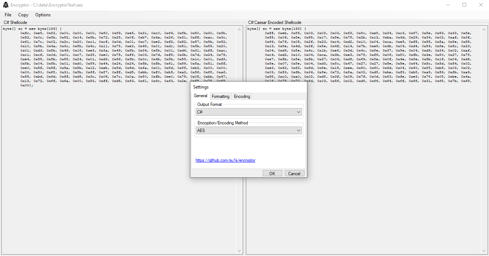

# Encryptor

Windows shellcode helper utility. Reads and encodes/encrypts binary files (shellcode) using various methods to avoid signature detections. Outputs encoded files and byte array definitions in various formats. 

## Encoding / Encryption methods 

- AES
- Caesar
- Insertion
- XANAX
- XOR

## Output formats 

- Base64
- C
- C#
- PowerShell
- Python
- Text
- VBA
- VB Script

## Usage 

 - Load shellcode/binary file to read and encode
 - Set options in the options screen 
 - Use save option to save, program will output:
    - Raw shellcode
    - Encoded/encrypted shellode
    - Raw byte array definition 
    - Encoded/encrypted byte array definition 
    - Variables and keys required for decoding to a settings file
 - Decoding/decryption functions are in Classes\Functions.cs should you wish to include them in your own projects 

## Screenshot

## Credits

Icon from [Hacker icons created by Freepik - Flaticon](https://www.flaticon.com/free-icons/hacker)
